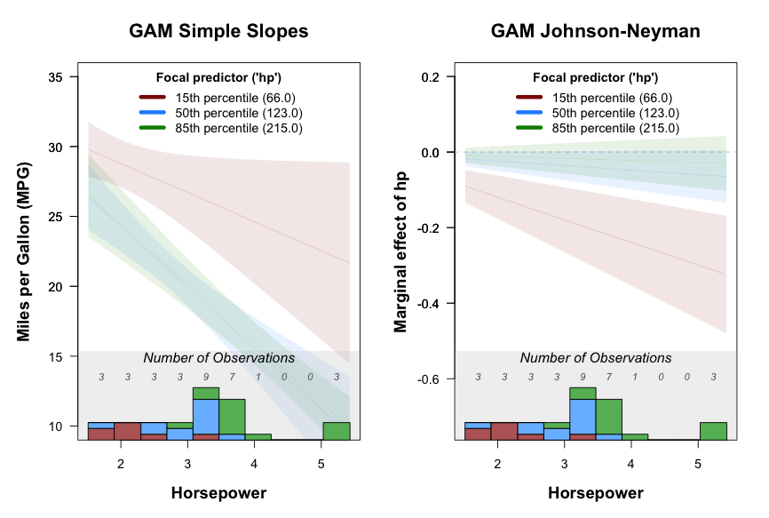

# Introduction

The interacting package is designed to simplify the exploration of interactions in statistical models, especially when using Generalized Additive Models (GAM). It provides tools for visualizing interactions using simple slopes (spotlight analysis) and Johnson-Neyman (JN) intervals. These methods help researchers interpret complex interaction effects in a straightforward manner.
Installation Guide
## Installation
To use the interacting package, you'll need to install it directly from GitHub. Ensure you have the devtools package installed.
```R
# Install devtools if not already installed
install.packages("devtools")

# Install the interacting package
library(devtools)
install_github("https://github.com/urisohn/interacting")

# Load the package
library(interacting)
```
## Example: Probing an Interaction

Below is a simple example of using the interprobe function with the built-in mtcars dataset. Here, we explore the interaction between hp (horsepower) and wt (weight) on mpg (miles per gallon).
``` R
# Load necessary libraries
library(interacting)
library(mgcv) # For GAM models

# Prepare the data
data(mtcars)
mtcars$cyl <- as.factor(mtcars$cyl)  # Convert 'cyl' to a factor for demonstration

# Fit a GAM model
model <- gam(mpg ~ s(hp, by = wt, k = 5), data = mtcars)

# Probe the interaction between 'hp' (focal predictor) and 'wt' (moderator)
interacting::interprobe(
  model = model,
  x = "hp",
  z = "wt",
  xlab = "Horsepower",
  ylab1 = "Miles per Gallon (MPG)",
  ylim1 = c(10, 35),
  save.as = NULL  # Set to a file path if you want to save the plot
)
```
The interprobe function will display two plots:
- GAM Simple Slopes: Shows how mpg varies with hp at different values of wt.
- GAM Johnson-Neyman: Highlights regions of significance where the interaction is statistically meaningful.



## Citation

If you use this package in your research, please cite:
- Simonsohn, U. (2024). Probe Interactions With GAM Simple Slopes and GAM Johnson-Neyman Curves. Psychological Methods. DOI: 10.1177/25152459231207787

## Warning

The interacting package is currently in its developer version. It may contain bugs or experimental features. Use it cautiously and report any issues.
## How to Contribute

Contributions are welcome! You can:
- Open issues for bugs or feature requests.
- Submit pull requests with improvements or fixes.

Happy analyzing! 🚀
